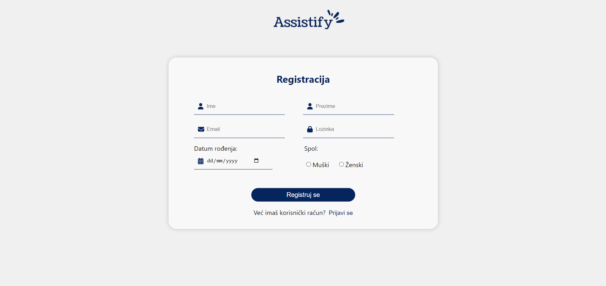
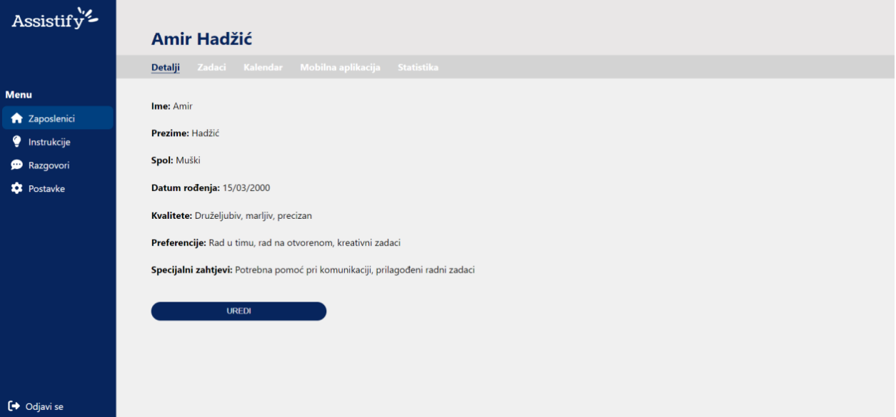
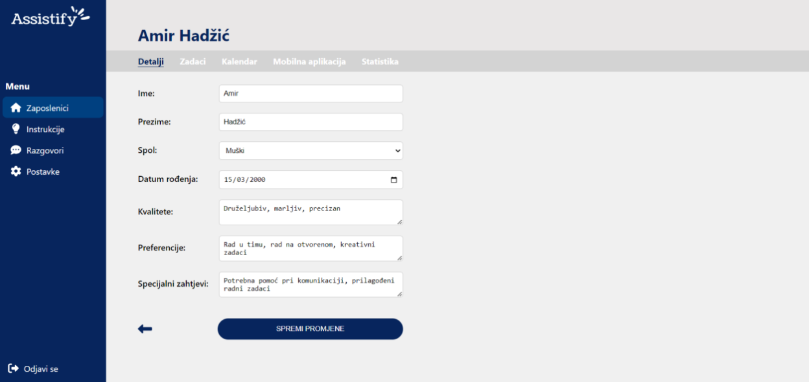
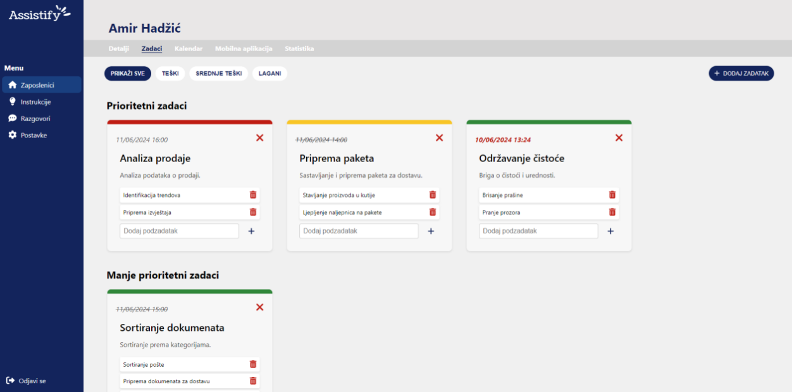
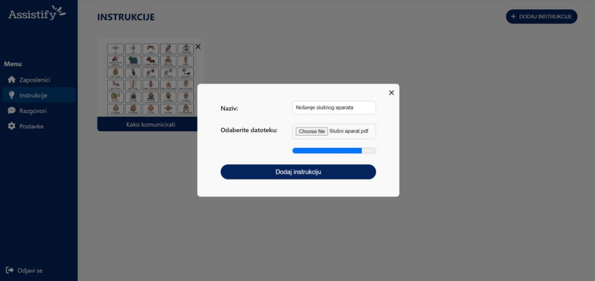

# Assistify

Assistify is a web application designed to help managers efficiently manage their employees with Down syndrome. This application offers various features that make task management, communication, and performance tracking seamless and effective.

## Features

1. **Task Management**
   - Add, edit, and delete tasks for employees.
   - Assign tasks to specific employees.
   - Set deadlines and priority levels for tasks.

2. **Mobile Application Customization**
   - Customize the mobile application interface used by employees.
   - Adjust settings to cater to the specific needs and preferences of employees with Down syndrome.

3. **Instructional Support**
   - Upload instructions in the form of PDFs, images, or videos.
   - Ensure employees have clear, accessible guidance for each task.

4. **Communication**
   - Direct messaging between managers and employees.

5. **Performance Tracking**
   - Monitor employee progress and performance.
   - Track the time required to complete tasks.

## Getting Started

### Prerequisites

- Node.js
- npm (Node Package Manager)
- MongoDB

### Installation

1. Clone the repository:
   ```sh
   git clone https://github.com/your-username/assistify.git

2. Install dependencies:
   ```sh
   npm install

3. Navigate to the project directory:
   ```sh
   cd assistify

4. Set up environment variables:
   Create a .env file in the root directory and add the following:
   ```sh
   MONGO_URI=your_mongodb_connection_string
   JWT_SECRET=your_jwt_secret

### Running the Application

1. Start the backend server:
   ```sh
   npm run server

2. Start the frontend development server:
   ```sh
   npm start

3. Open your browser and navigate to http://localhost:3000.

## Usage

1. **Login/Register**:
   - Managers can register and log in to access the dashboard.
   
   

2. **Profile Management**:
   - Managers can edit their profile information, including name, surname, and other personal details.
   

3. **Dashboard**:
   - View an overview of employees, add new employee
   
   

4. **Employee Management**:
   - Managers can view detailed information about employees.
        
   - Managers can edit employee information.
        

5. **Task Management**:
   - Managers can view detailed information about tasks.
        
   - Managers can add new task,
        
   - Managers can view/add tasks using calendar.
        
     
6. **Customization**:
   - Adjust the mobile application settings to suit employee needs.
     

7. **Instructions**:
   - View an overview of instructions.
     
   - Upload instructional materials for tasks.
     

8. **Communication**:
   - Send and receive messages with employees.
     
     

9. **Performance Tracking**:
   - Monitor and analyze employee performance through statistics.
     
